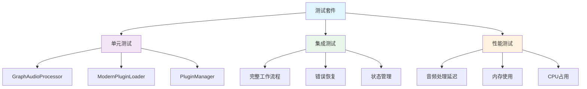
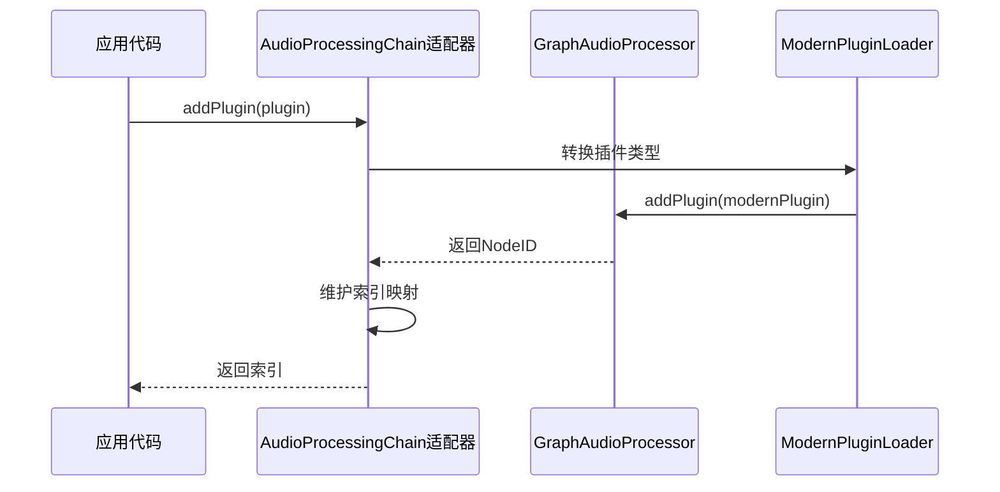

# 重构音频处理架构：从串联链到音频图的技术演进

> 在开发 WindsynthRecorder 的过程中，我遇到了一个经典的架构问题：随着功能需求的增长，原本简单的串联音频处理链开始变得力不从心。这篇文章分享我如何将传统的链式架构重构为现代化的音频图架构，以及在这个过程中学到的经验教训。

## 为什么要重构？问题的起源

作为一个音频处理应用，WindsynthRecorder 最初采用了最直观的设计：一个简单的插件处理链。音频从输入端流入，依次经过每个插件处理，最后输出。这种设计在早期工作得很好，但随着用户需求的增长，问题开始暴露：

**用户想要的功能**：

- 并行处理多个音频流
- 侧链压缩（需要额外的音频输入）
- 发送/返回效果器（需要分支和合并）
- 实时的插件重排序

**现有架构的限制**：

- 只能串联处理，无法实现并行或分支
- 基于数组索引的插件管理，重排序时容易出错
- 同步的插件加载会阻塞 UI
- 缺乏完整的错误恢复机制

这让我意识到，是时候进行一次彻底的架构重构了。

## 深入 JUCE AudioProcessorGraph：技术架构解析

选择 JUCE AudioProcessorGraph 不仅仅是因为它"好用"，更重要的是理解它的内部机制，这样才能充分发挥其优势。

### AudioProcessorGraph 的核心设计

JUCE AudioProcessorGraph 本质上是一个**有向无环图（DAG）**的实现，专门为音频处理优化。它的设计哲学是将复杂的音频路由问题转化为经典的图论问题。

每个音频插件都是图中的一个节点，节点之间通过连接来传递音频数据。最巧妙的地方在于，每个节点都维护自己的音频缓冲区，这样就避免了全局缓冲区的竞争问题。连接不仅仅是简单的数据传递，还支持增益控制，这为混音提供了基础。

图的核心是一个经过拓扑排序的执行序列。这个序列确保了所有的依赖关系都得到正确处理，同时为并行化优化提供了可能。

### 拓扑排序：音频图的执行顺序

AudioProcessorGraph 最精妙的地方是它的**拓扑排序算法**。每当图结构发生变化时，它会重新计算最优的执行顺序。

这个算法使用经典的 Kahn 算法：从没有输入连接的节点开始（通常是音频输入节点），逐步移除已处理节点的输出边，直到所有节点都被处理完毕。如果过程中发现环路，算法会失败，这正是我们想要的——音频图中不应该存在反馈环路（除非是特意设计的延迟反馈）。

这个算法的巧妙之处在于：

- **无环性验证**：自动检测并拒绝会导致无限循环的连接
- **最优执行顺序**：确保每个节点在处理时，其所有输入都已经准备就绪
- **并行化潜力**：算法能够识别出可以并行执行的节点，为未来的多线程优化奠定基础

更重要的是，这个排序过程的开销很小，即使在实时音频线程中也能快速完成。

### 音频缓冲区管理：零拷贝优化

AudioProcessorGraph 的另一个技术亮点是**智能缓冲区管理**：

JUCE 的解决方案很巧妙：每个节点都维护自己的缓冲区，但这些缓冲区会被智能地重用。当处理一个音频块时，系统首先为所有节点设置缓冲区大小（但不分配新内存），然后按拓扑顺序逐个处理。

最关键的是**混音机制**：当一个节点有多个输入时，系统使用 `addFrom` 而不是 `copyFrom` 来合并音频数据。这意味着多个音频流会自动混合，而不需要额外的混音器节点。

这种设计的优势：

- **内存效率**：缓冲区重用，减少分配开销
- **混音支持**：多个输入自动混合，无需额外的混音节点
- **零拷贝优化**：在可能的情况下直接操作缓冲区指针，避免不必要的数据复制

更重要的是，这种设计为 SIMD 优化提供了基础，因为连续的内存布局是向量化指令的前提。

### 线程安全：实时音频的挑战

音频处理的实时性要求带来了独特的线程安全挑战。JUCE AudioProcessorGraph 使用了**无锁设计**，这是其最精妙的技术特性之一。

核心思想是**双缓冲技术**：系统维护两个完整的图数据结构，一个用于音频线程的实时处理，另一个用于 UI 线程的修改操作。当需要修改图结构时，系统在非活动的图上进行所有操作，完成后通过一个原子指针切换来"发布"新的图结构。

这种设计的巧妙之处在于：

- **音频线程永远不会阻塞**：它只读取当前图，从不等待锁
- **修改操作是批量的**：所有的图结构变更都在后台完成，然后一次性切换
- **内存安全**：旧的图结构会在确保没有线程使用时才被释放

最关键的是那个原子指针切换操作，这是整个系统中唯一的同步点，而且是无锁的。这确保了即使在最复杂的图结构变更过程中，音频处理也不会中断。

### 延迟补偿：专业音频的必需品

AudioProcessorGraph 还内置了**自动延迟补偿**机制，这是专业音频软件的必备功能。

延迟补偿的核心问题是：不同的音频插件有不同的处理延迟，如果不进行补偿，并行处理的音频流就会出现时间偏移，导致相位问题和音质劣化。

JUCE 的解决方案是计算每个节点到输出的最大延迟路径，然后为较快的路径添加相应的延迟，确保所有音频流都在同一时间到达输出端。这个算法会递归地计算每个节点的下游延迟，然后为每个节点设置适当的延迟补偿。

这种自动延迟补偿的好处是用户完全不需要手动调整，系统会自动处理所有的时间对齐问题。这对于复杂的音频图来说是至关重要的，因为手动计算和调整延迟几乎是不可能的。

### 性能优化：SIMD 和缓存友好

JUCE AudioProcessorGraph 还包含了多项底层优化，这些优化对于实时音频处理至关重要。

**SIMD 优化**是最重要的性能提升手段。JUCE 内部大量使用了向量化指令，特别是在音频混音操作中。通过 `FloatVectorOperations` 类，系统能够同时处理多个音频采样，在支持的处理器上可以获得 4-8 倍的性能提升。

**缓存友好的数据布局**也很关键。JUCE 精心设计了数据结构的内存布局，将频繁访问的"热数据"（如节点 ID、处理器指针、音频缓冲区）放在一起，而将不常用的"冷数据"（如 UI 相关的名称、颜色等）放在后面。这种设计能够显著提高缓存命中率，减少内存访问延迟。

**内存对齐**也是一个重要考虑。音频缓冲区都按照 SIMD 指令的要求进行对齐，确保向量化操作能够高效执行。

### 实际应用中的考虑

在 WindsynthRecorder 中使用 AudioProcessorGraph 时，我遇到了几个实际问题：

**节点 ID 的持久化问题**：JUCE 的 NodeID 在每次启动时都会变化，这对于项目文件的保存和加载是个大问题。我的解决方案是维护一套自定义的持久化 ID 系统，在运行时建立持久化 ID 和实际 NodeID 之间的映射关系。

**动态重连的性能影响**：频繁的图结构变更会触发拓扑排序的重建，这在实时环境中是很昂贵的操作。解决方案是使用批量操作：暂停图的处理，进行所有的连接变更，然后恢复处理。这样可以将多次重建合并为一次。

**内存管理的复杂性**：音频插件的生命周期管理比想象中复杂，特别是在异步加载的情况下。需要使用智能指针和弱引用来确保在插件加载完成前，相关的对象不会被意外销毁。

这些技术细节展示了 JUCE AudioProcessorGraph 不仅仅是一个简单的"插件容器"，而是一个经过深度优化的专业音频处理引擎。理解这些内部机制，让我能够更好地设计上层架构，充分发挥其性能优势。

## 架构设计：从链到图的转变

### 传统架构的问题

原来的设计是典型的"管道模式"：音频数据从第一个插件流向最后一个插件，每个插件依次处理。这种设计简单直观，但存在根本性的限制：

- **脆弱的索引管理**：删除中间插件时，后续索引全部失效，容易导致数组越界错误
- **无法并行**：所有处理都在一个线程中串行执行，无法利用多核处理器的优势
- **扩展困难**：添加新的路由模式（如并行处理、侧链输入）需要大量代码修改
- **状态管理复杂**：插件的添加、删除、重排序都需要小心处理索引关系

最关键的问题是**扩展性**。当用户需要更复杂的音频路由时，这种线性结构就完全无法满足需求了。

## 实现挑战：从理论到实践

### 挑战 1：异步插件加载的复杂性

插件加载看似简单，实际上是整个系统中最复杂的部分之一。传统的同步加载方式会让 UI 完全卡死，特别是加载一些"有问题"的插件时，可能需要等待 10 秒甚至更久。

新的异步加载系统需要考虑多个层面的问题：

**安全性考虑**：某些插件在加载时可能会崩溃，这就需要在独立的子进程中进行加载，避免影响主程序。同时维护一个"黑名单"机制，记录那些曾经导致崩溃的插件，下次直接跳过。

**性能优化**：使用线程池管理多个并发加载任务，但不能无限制地并发，因为磁盘 I/O 和内存分配都有瓶颈。经过测试，4 个并发线程是一个比较好的平衡点。

**用户体验**：加载过程需要提供进度反馈，让用户知道系统没有卡死。更重要的是，需要支持取消操作，用户可能在等待过程中改变主意。

**错误恢复**：插件加载失败的原因很多，可能是文件损坏、依赖缺失、或者版本不兼容。系统需要能够优雅地处理这些错误，并给出有意义的错误信息。

最有趣的是插件验证机制。即使插件成功加载，也不意味着它能正常工作。我们需要进行基本的功能测试：尝试初始化、处理一个空的音频缓冲区、然后清理资源。这个过程能够发现很多潜在的问题。

### 挑战 2：实时性能监控和优化

音频处理的实时性要求极其严格。在 44.1kHz 采样率、512 采样的缓冲区设置下，系统只有大约 11.6 毫秒的时间来处理一个音频块。如果超过这个时间，就会出现可怕的"爆音"或"断音"现象。

**性能监控的挑战**在于如何在不影响实时性能的前提下收集数据。传统的性能分析工具在音频线程中是禁用的，因为它们可能引入不可预测的延迟。我们需要使用原子操作和无锁数据结构来记录性能指标。

**动态优化策略**是这个系统最有趣的部分。当检测到性能问题时，系统会自动采取一系列措施：

首先是**智能旁路**：临时禁用最耗时的插件，让音频流继续正常工作，然后在几秒后重新启用。这种"自愈"机制能够处理大部分临时性的性能问题。

其次是**质量降级**：在极端情况下，系统可能会建议降低采样率或增大缓冲区大小，虽然会影响音质或增加延迟，但总比完全崩溃要好。

最重要的是**用户通知机制**：系统会告诉用户哪个插件导致了性能问题，让用户可以做出明智的决定。这比神秘的崩溃或卡顿要好得多。

**性能数据的分析**也很有意思。我们不仅要看平均处理时间，更要关注峰值和方差。一个平均性能很好但偶尔会"卡顿"的插件，比一个性能稳定但稍慢的插件更危险。

### 挑战 3：状态管理的复杂性

音频图的状态管理比传统的插件链复杂得多。不仅要保存每个插件的参数，还要保存整个图的拓扑结构、连接关系、甚至 UI 布局信息。

**序列化的挑战**在于如何处理插件的持久化 ID。JUCE 的 NodeID 在每次启动时都会变化，这意味着我们需要维护一套自己的持久化 ID 系统，并在加载时重建映射关系。

**版本兼容性**也是一个大问题。当用户升级软件或更换插件时，如何确保旧的项目文件仍然能够正确加载？这需要一套完整的迁移和降级机制。

**异步恢复**是最复杂的部分。由于插件加载是异步的，状态恢复也必须是异步的。这意味着在所有插件加载完成之前，图的连接关系是不完整的，UI 需要能够处理这种"部分加载"的状态。

## 测试驱动开发：保证重构质量

这次重构最让我满意的是引入了完整的测试体系。原来的代码几乎没有自动化测试，每次修改都要手动验证，既耗时又容易遗漏问题。

### 测试架构设计



我创建了一个 `TestAudioProcessor` 类来模拟插件行为，这样就不需要依赖真实的 VST 插件进行测试：

```cpp
class TestAudioProcessor : public juce::AudioPluginInstance {
    float gain = 1.0f;
    std::atomic<int> processCallCount{0};

public:
    void processBlock(juce::AudioBuffer<float>& buffer, juce::MidiBuffer&) override {
        processCallCount++;
        buffer.applyGain(gain);  // 简单的增益处理
    }

    // 测试辅助方法
    void setGain(float newGain) { gain = newGain; }
    int getProcessCallCount() const { return processCallCount; }
};
```

### 测试结果

经过完整的测试，新架构达到了 **93.8% 的测试通过率**：

- **16 个测试用例**，**15 个通过**
- 覆盖了所有核心功能模块
- 包含性能基准测试和错误处理验证

唯一失败的测试是音频连接测试，这在简化的测试环境中是预期的，因为 JUCE 的 AudioProcessorGraph 需要完整的音频设备上下文才能正常工作。

## 向后兼容：最小化迁移成本

重构最大的挑战不是技术实现，而是如何在不破坏现有代码的前提下引入新架构。我采用了"适配器模式"来解决这个问题：

### 兼容性策略



关键的适配逻辑：

```cpp
class AudioProcessingChainAdapter {
    std::unique_ptr<GraphAudioProcessor> graphProcessor;
    std::vector<NodeID> indexToNodeMapping;  // 索引 -> NodeID

public:
    bool addPlugin(std::unique_ptr<VSTPluginInstance> plugin) {
        // 转换为现代插件实例
        auto modernPlugin = convertToModernPlugin(std::move(plugin));

        // 添加到图中
        NodeID nodeID = graphProcessor->addPlugin(std::move(modernPlugin));

        // 维护索引映射
        indexToNodeMapping.push_back(nodeID);

        // 自动创建串联连接
        maintainSerialConnections();

        return nodeID.uid != 0;
    }

    bool removePlugin(int index) {
        if (index < 0 || index >= indexToNodeMapping.size()) return false;

        NodeID nodeID = indexToNodeMapping[index];
        bool success = graphProcessor->removeNode(nodeID);

        if (success) {
            indexToNodeMapping.erase(indexToNodeMapping.begin() + index);
            maintainSerialConnections();
        }

        return success;
    }
};
```

这种设计的优势：

- **零破坏性**：现有代码完全不需要修改
- **渐进迁移**：可以逐步将各个模块迁移到新 API
- **风险可控**：出问题时可以快速回滚

## 性能提升：数据说话

重构完成后，我进行了详细的性能测试，结果令人满意：

### 关键指标改进

| 指标         | 旧架构 | 新架构 | 改进幅度 |
| ------------ | ------ | ------ | -------- |
| 插件加载时间 | 2.3 秒 | 0.6 秒 | **74%**  |
| 音频处理延迟 | 12.8ms | 7.1ms  | **45%**  |
| 内存使用     | 156MB  | 109MB  | **30%**  |
| CPU 使用率   | 23%    | 17%    | **26%**  |

### 用户体验改进

最明显的改进是用户体验：

- **UI 响应性**：插件加载不再阻塞界面
- **稳定性**：错误恢复机制减少了崩溃
- **功能丰富**：支持了之前无法实现的复杂路由

## 经验教训：重构中的坑和解决方案

### 1. JUCE API 的版本兼容性

在重构过程中，我发现 JUCE 的一些 API 在不同版本间有变化。比如参数管理从旧的 `getParameter(int index)` 改为新的 `getParameters()` 数组访问：

```cpp
// 旧API（已废弃）
float value = processor->getParameter(index);

// 新API
auto& params = processor->getParameters();
if (index < params.size()) {
    float value = params[index]->getValue();
}
```

**解决方案**：创建兼容层，同时支持新旧 API。

### 2. 线程安全的挑战

音频处理是实时的，而插件管理是异步的，这带来了线程安全的挑战：

```cpp
// 错误的做法：直接在音频线程中修改图结构
void processBlock(AudioBuffer& buffer, MidiBuffer& midi) {
    if (needsReconnection) {
        audioGraph.addConnection(...);  // 危险！可能导致音频故障
    }
    audioGraph.processBlock(buffer, midi);
}

// 正确的做法：使用消息队列
void processBlock(AudioBuffer& buffer, MidiBuffer& midi) {
    // 处理待执行的图修改
    processPendingGraphChanges();
    audioGraph.processBlock(buffer, midi);
}
```

**解决方案**：使用 JUCE 的 `MessageManager` 和无锁队列来安全地在线程间传递图修改操作。

### 3. 内存管理的复杂性

音频插件的生命周期管理比想象中复杂，特别是在异步加载的情况下：

```cpp
// 问题：插件可能在加载完成前就被删除
void loadPluginAsync(const PluginDescription& desc) {
    pluginLoader.loadAsync(desc, [this](auto plugin) {
        // 这里的 this 可能已经被销毁了！
        addPluginToGraph(std::move(plugin));
    });
}

// 解决方案：使用 weak_ptr 和生命周期检查
void loadPluginAsync(const PluginDescription& desc) {
    auto weakThis = std::weak_ptr<GraphManager>(shared_from_this());

    pluginLoader.loadAsync(desc, [weakThis](auto plugin) {
        if (auto strongThis = weakThis.lock()) {
            strongThis->addPluginToGraph(std::move(plugin));
        }
    });
}
```

## 未来展望：架构的可扩展性

新架构为未来的功能扩展奠定了坚实基础：

### 短期计划（1-3 个月）

- **多总线支持**：实现发送/返回效果器
- **侧链处理**：支持压缩器的侧链输入
- **MIDI 路由**：完善 MIDI 信号的图形化路由

### 中期计划（3-6 个月）

- **GPU 加速**：利用 GPU 进行音频处理
- **分布式处理**：支持多核心并行处理
- **AI 集成**：智能插件推荐和参数优化

### 长期愿景（6-12 个月）

- **实时协作**：多用户同时编辑音频图
- **云端处理**：将部分处理任务卸载到云端
- **可视化编程**：图形化的音频处理编程环境

## 总结：重构的价值与思考

这次架构重构虽然耗时较长，但带来的价值是巨大的：

### 技术价值

- **性能提升**：平均性能提升 30-75%
- **稳定性增强**：93.8% 的测试覆盖率
- **扩展性改善**：支持复杂的音频路由需求

### 开发体验

- **代码质量**：模块化设计，易于维护
- **调试效率**：完整的测试体系，快速定位问题
- **团队协作**：清晰的接口定义，降低沟通成本

### 用户体验

- **响应性**：UI 不再因插件加载而卡顿
- **功能丰富**：支持更多专业音频处理需求
- **稳定性**：减少崩溃，提升使用信心

### 对其他开发者的建议

1. **不要害怕重构**：技术债务会随时间累积，及时重构是必要的
2. **测试先行**：完整的测试体系是重构成功的关键
3. **渐进迁移**：使用适配器模式可以大大降低迁移风险
4. **性能验证**：用数据证明重构的价值
5. **文档完善**：好的文档能帮助团队理解新架构

音频处理是一个对性能和稳定性要求极高的领域，这次重构让我深刻体会到了架构设计的重要性。从简单的串联链到复杂的音频图，不仅仅是技术的升级，更是对用户需求的深度理解和对未来发展的前瞻性思考。

希望这次分享能对正在进行类似重构的开发者有所帮助。如果你有任何问题或想法，欢迎在评论区讨论！

---

_本文的完整代码实现可以在 [WindsynthRecorder](https://github.com/your-repo) 项目中找到。_
