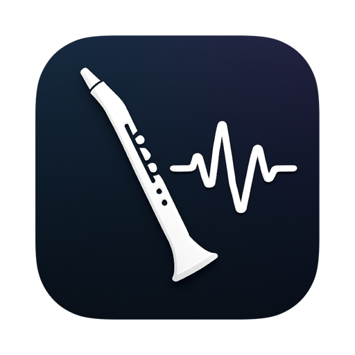

  

    
  

  <h1 align="center"><b>WindsynthRecorder</b></h1>
  

    A professional audio recording and processing application for Synthesizer.
     
     
    <b>Download for </b>
    <a href="">Source Code</a>
     
  

WindsynthRecorder 是一款专业的 macOS 音频录制与处理应用，采用 SwiftUI 和 JUCE 构建。该应用专为电子管乐器(SR)录音设计，支持高级 VST 插件，实现实时与离线音频处理。

<table>
  <tr>
    <th>Startup</th>
    <th>HomePage</th>
    <th>AudioMixView</th>
  </tr>
  <tr>
    <td>
      
    </td>
    <td>
      
    </td>
    <td>
      
    </td>
  </tr>
  <tr>
    <th>VSTManager</th>
    <th>Logger</th>
    <th>BatchProcessor</th>
  </tr>
  <tr>
    <td>
      
    </td>
    <td>
      
    </td>
    <td>
    
    </td>
  </tr>
</table>

## 设计初衷

当我们希望直接录制电子管乐器的内部音源时，需要将音频输入连接到电脑。如果还需要伴奏，则还需额外连接伴奏音轨的音频输入。

根据SR用户反馈，专业的数字音频工作站（如 Logic Pro、Studio One、Ableton Live）对这些乐器的演奏群体来说并不算友好——尽管这些 DAW 功能强大，UI/UX 也远胜于我们的应用。

> 但是最后在众多的 DAW 中，找到了符合该群体用户的最佳选择，继续设计该应用已无意义

## 核心功能

- **音频录制**：高质量音频录制，支持多种格式
- **VST 插件集成**：完整支持 VST3 插件，具备实时处理能力
- **音频处理**：专业音频处理流程，集成 FFmpeg
- **多窗口界面**：基于 SwiftUI 的现代多窗口应用
- **实时音频混音**：专业混音台，支持 VST 效果链
- **批量处理**：自动化音频文件批量处理

## 技术架构

该应用采用混合架构，结合了：

- **SwiftUI**：用于界面和应用逻辑
- **JUCE C++**：负责音频处理与 VST 插件托管
- **AVFoundation**：系统音频集成
- **FFmpeg**：音频格式转换与编码

> 目前程序正处于过渡阶段，采用 **CoreAudio** 与 **JUCE** 混合方案，现正逐步将所有功能迁移至 **JUCE**

## Author

WindsynthRecorder © Wibus, Released under MIT. Created on Jul 24, 2025

> [Personal Website](http://wibus.ren/) · [Blog](https://blog.wibus.ren/) · GitHub [@wibus-wee](https://github.com/wibus-wee/) · Telegram [@wibus✪](https://t.me/wibus_wee)
