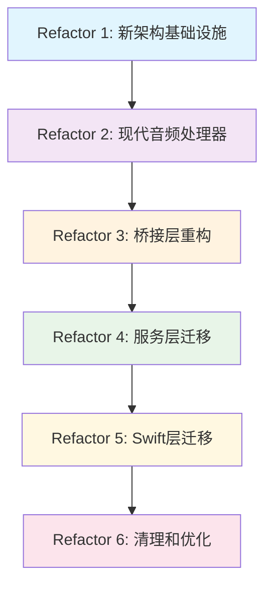

# 完全重写计划：6 个阶段重构

🔧 Refactor 1: 新架构基础设施完善
状态：✅ 已完成 | 时间：0 天 | 风险：无

我们已经有了：

GraphAudioProcessor
ModernPluginLoader
PluginManager
PresetManager
完整的测试套件

🎯 Refactor 2: 现代音频处理器设计
时间：3-4 天 | 风险：低 | 优先级：最高

目标
创建 ModernAudioProcessor 类，提供现代化的 API 来替代 AudioProcessingChain

核心设计原则
class ModernAudioProcessor {
public:
// 现代化的插件管理 - 使用 NodeID 而不是索引
NodeID addPlugin(const juce::PluginDescription& description);
bool removePlugin(NodeID nodeID);
std::vector<NodeID> getAllPlugins() const;

    // 灵活的连接管理 - 支持复杂路由
    bool connectAudio(NodeID source, int sourceChannel,

交付物
ModernAudioProcessor.hpp/cpp
完整的 API 文档
单元测试套件
使用示例代码
性能基准测试
🌉 Refactor 3: 桥接层重构
时间：2-3 天 | 风险：中 | 依赖：Refactor 2

目标
重构 VSTBridge.mm，支持新旧两套 API 并存

交付物

新的 C 接口定义
兼容性包装层
更新的桥接头文件
桥接层测试

⚙️ Refactor 4: 服务层迁移
时间：3-4 天 | 风险：中 | 依赖：Refactor 3

目标
迁移 RealtimeProcessor 和 OfflineProcessor 到新架构

迁移步骤
Phase 4.1：添加新接口，保持旧接口
Phase 4.2：内部实现切换到新架构
Phase 4.3：性能测试和优化
Phase 4.4：标记旧接口为 deprecated
交付物
重构的 RealtimeProcessor
重构的 OfflineProcessor
性能对比报告
功能兼容性验证

📱 Refactor 5: Swift 层迁移
时间：4-5 天 | 风险：高 | 依赖：Refactor 4

目标
迁移 Swift 层代码到新 API，提供更好的用户体验

重点组件
JUCEAudioEngine.swift
VSTManagerExample.swift
AudioProcessor.swift
新的 Swift API 设计
迁移策略
Phase 5.1：创建新的 Swift API
Phase 5.2：UI 组件适配新 API
Phase 5.3：用户体验优化
Phase 5.4：移除旧 API 调用
交付物
新的 Swift API 层
更新的 UI 组件
用户体验测试
API 文档更新

🧹 Refactor 6: 清理和优化
时间：1-2 天 | 风险：低 | 依赖：Refactor 5

目标
移除旧代码，优化性能，完成最终清理

清理内容
删除 AudioProcessingChain 相关代码
删除 VSTPluginManager 旧实现
删除 ProcessingNode 类
清理无用的桥接代码
更新文档和注释
优化内容
内存使用优化
启动时间优化
音频处理延迟优化

代码结构优化
📊 总体时间线
阶段 时间 累计 风险 可并行
Refactor 1 ✅ 完成 0 天 无 -
Refactor 2 3-4 天 4 天 低 -
Refactor 3 2-3 天 7 天 中 -
Refactor 4 3-4 天 11 天 中 部分
Refactor 5 4-5 天 16 天 高 部分
Refactor 6 1-2 天 18 天 低 -
总计：约 3-4 周

🛡️ 风险控制策略
功能标志：每个阶段都支持新旧 API 切换
渐进迁移：保持系统始终可用
自动化测试：每次变更都有测试覆盖
性能监控：确保性能不降级
回滚计划：每个阶段都可以快速回滚
🎯 下一步行动
我建议从 Refactor 2 开始，因为 API 设计是整个重构的核心。您希望我开始设计 ModernAudioProcessor 的 API 吗？
